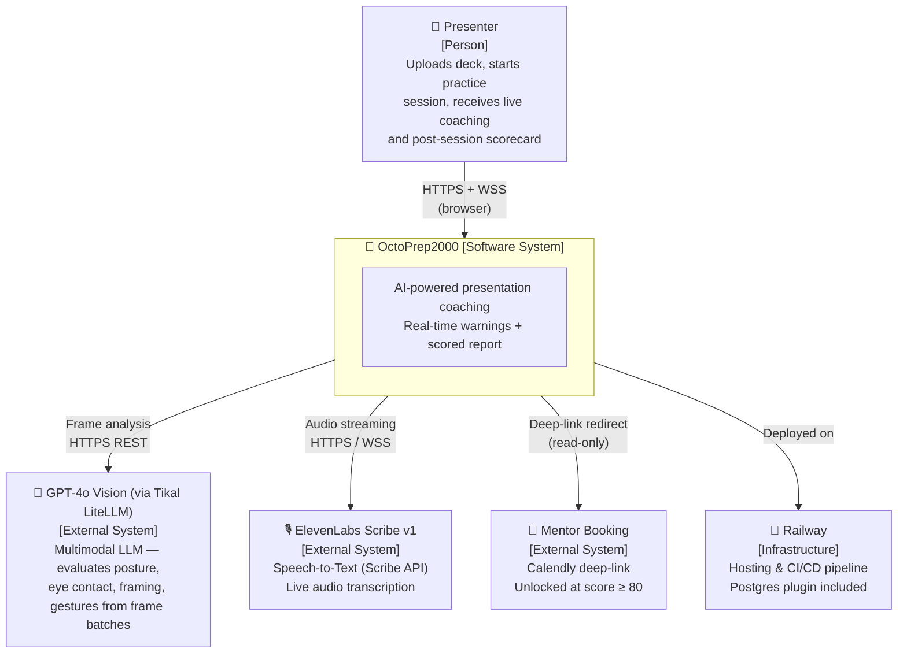
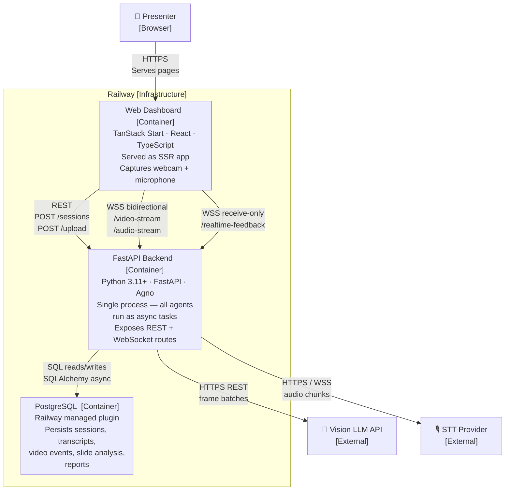
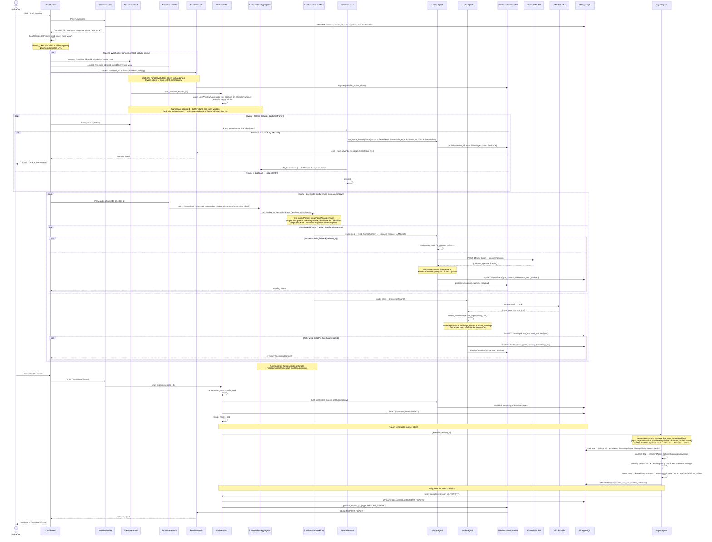
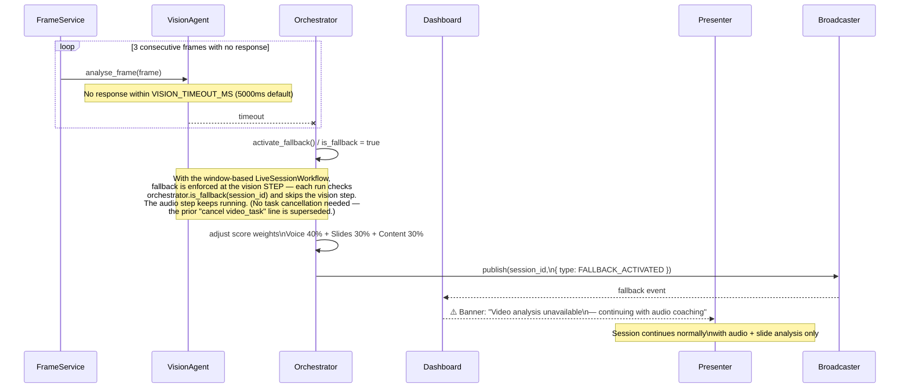

# OctoPrep2000 — Technical Architecture (C4)

**System**: OctoPrep2000
**Version**: 1.6
**Date**: 2026-06-24
**Architect**: Tikal Fuse Day Team
**Status**: Approved for implementation — agno-Workflow orchestration layer added (v1.6)

> **v1.6 changelog (2026-06-24)** — agno-Workflow orchestration layer (implemented + tested on
> branch `agno-workflows-flow`). Adds an in-process orchestration substrate; **no change to
> persistence ownership or the pub/sub model** (Constitution v2.0.0 Principle II + V preserved):
> - New package `packages/backend/workflows/` with **three agno (v2.6.16) Workflows**. agno
>   `Workflow`/`Team`/`Parallel` objects are pure **in-process orchestration glue**: every one is
>   constructed with `telemetry=False` and `db=None`, performs **no DB writes**, and holds **no
>   durable session state**. Agents remain the sole writers of their own role-scoped tables and
>   emit completion signals exactly as before.
> - **PptxPrepWorkflow** (`workflows/pptx_prep.py`) — pre-session, one-shot, triggered by the PPTX
>   upload background task. Three sequential Steps delegating to PPTXAgent phases:
>   `extract` → `review` → `write`.
> - **LiveSessionWorkflow** (`workflows/live_session.py` + `workflows/live_window.py`) — window-based.
>   A `LiveWindowAggregator` (owned per session by `SessionRuntime`) buffers deduped frames; each
>   arriving ~2s audio chunk closes a window and fires ONE workflow run as a detached task (a
>   periodic tick flushes vision-only tails). Each run is a single agno **`Parallel`** group named
>   **`LiveAnalysisTeam`** with two concurrent steps (`vision`, `audio`) that delegate into the
>   long-lived, stateful VisionAgent/AudioAgent on `SessionRuntime`. Intentionally a `Parallel`, NOT
>   a coordinator `Team`. Instant GCV face-detection feedback stays fire-and-forget on frame ingest,
>   OUTSIDE the window.
> - **ReportWorkflow** (`workflows/report.py`) — runs at session end; `ReportAgent.generate` is now a
>   thin wrapper that runs it. A **sequential** pipeline of genuine data dependencies:
>   `read` → `content` → `delivery` → `score`. Deterministic scoring stays pure Python (replay
>   baseline equivalence holds).
> - The §11 "Agno session task model" open decision is now **resolved** — Agno is load-bearing
>   orchestration glue, not just brand-tax; the raw-`asyncio` fallback path is retired.
> - No data-model, endpoint-contract, scoring-weight, or persistence-ownership changes in this revision.
>
> **v1.4 changelog (2026-06-23)** — frontend stack + structure sync (Y2K redesign), no backend changes:
> - UI component stack added: shadcn/ui, Radix UI primitives, Tailwind CSS v4, `class-variance-authority`,
>   `clsx`, `tailwind-merge`, `tw-animate-css`, `lucide-react` — see §6 Technology Stack.
> - Web fonts added: Tektur, Chakra Petch, Space Mono — implements the Y2K/VHS-retro direction
>   from `docs/PRD.md` §10. (`@fontsource-variable/geist` is also in `package.json` but is an
>   unused leftover from the prior design iteration — `PRODUCT.md`'s Anti-references explicitly
>   bans the Geist pairing. Worth pruning from `package.json`.)
> - Frontend monorepo structure (§9) updated: new routes `start.tsx`, `archive.tsx`,
>   `leaderboard.tsx`, `achievements.tsx`, `settings.tsx`; new `components/{ui,shell,chrome}/`
>   and `lib/{wallet,mockReportData}` modules — see `packages/web-dashboard/DESIGN.md` and
>   `PRODUCT.md` for the full design system, which are the authoritative source for visual
>   detail (this doc only tracks structure/stack).
> - "Spec it" (§6) was a placeholder name — corrected to **Specify / spec-kit**, now actually
>   installed per PR #1 (`speckit-init`) — see root `README.md` "Spec-Kit Setup".
> - No backend, agent, or data-model changes in this revision.
>
> **v1.3 changelog (2026-06-17)** — addresses architecture critique:
> - **Vision API swapped** to GPT-4o Vision via Tikal LiteLLM (Google Cloud Vision dropped — couldn't do posture/body language)
> - Audio chunk size cut from 5s → 2s to meet NFR-002 (≤1s filler latency)
> - VideoEvent inserts batched (every 1s or N=20) inside the VisionAgent to avoid a write bottleneck
> - PPTX text persisted to DB on parse (`slides.raw_text`) — survives container restart
> - `/health` route added; Railway keep-warm pings it
> - `DEMO_MODE=replay` env flag — replays canned events if external APIs flake during demo
> - WS auto-reconnect on browser side with exponential backoff
> - `POST /sessions` rate-limited (slowapi, 5 req/min/IP)
> - `topic` field validated (min 8 chars, non-empty, LLM sanity check)
> - Agno fallback path documented (raw `asyncio.create_task` if Agno PoC fails)
> - Section 10 fallback weights typo fixed (Sync → Content)

---

## Architectural Decisions (locked before writing this doc)

| Decision | Choice | Rationale |
|---|---|---|
| Deployment topology | **Single FastAPI process** | All agents run as `asyncio` tasks inside one app. One Railway service, zero inter-service networking. Correct for a 6-hour build. |
| Database | **PostgreSQL on Railway** | Native Railway plugin, one-click setup, relational model maps cleanly to all entities. |
| PPTX file storage | **Ephemeral /tmp** | Analyse on upload, discard after. Zero setup cost. Acceptable for demo lifecycle. |
| Session ownership | **Backend (Orchestrator)** | `POST /sessions` creates the record and returns a UUID. Frontend never forges IDs. |
| Pub/sub mechanism | **In-process asyncio** | Single process → `asyncio.Queue` + a `dict[session_id → set[WebSocket]]` broadcaster. No Redis needed. |
| Agent write access | **Each agent owns its own role-scoped table** | Every agent writes only its own table(s) directly via the Repository (through the shared `AgentPersistence` helper), then emits a `CompletionSignal` to the Orchestrator (`orchestrator.notify_complete(session_id, kind)`, kind ∈ {VIDEO, AUDIO, PPTX, CONTENT, REPORT}) — signalling only **after** the write commits (durability before notify). One writer per table; no agent writes another's table. The Orchestrator no longer relays raw payloads as a persistence pipe; it owns session lifecycle, cross-agent coordination, fallback, and broadcasts, and assembles the report by reading the agreed tables. Agents may also read from DB for context. |
| Session isolation | **Session Capability Token** | No user accounts required. `POST /sessions` returns `session_id` + `access_token` (two separate UUIDs). All session operations require both. Report has a separate opt-in `share_token` for read-only sharing. See Section 4.5. |
| Deployment | **Local only for hackathon** | No Railway deployment required. Everything runs locally. Railway is a Phase 3 bonus if time permits. |
| Live feedback UI | **Phase 3 bonus** | WebSocket infrastructure (`ws://backend/realtime-feedback`) is built in Phase 1. Live toast UI + user toggle is Phase 3 only. |

---

## 1. C4 Level 1 — System Context

> Who uses OctoPrep2000, and what external systems does it depend on?



**Key constraints visible at this level:**
- The Vision API and STT provider are the **two biggest external latency risks** — both TBD and must be validated in spikes before June 24.
- Calendly is a **deep-link only** — OctoPrep never calls their API.
- Everything runs on a **single Railway project** — no multi-cloud, no CDN for MVP.

---

## 2. C4 Level 2 — Container Diagram

> What are the deployable units inside OctoPrep2000?



**Container responsibilities:**

| Container | Language / Framework | Owns | Talks to |
|---|---|---|---|
| Web Dashboard | TypeScript / TanStack Start | Session UI, live toasts, scorecard rendering | Backend (REST + WSS) |
| FastAPI Backend | Python 3.11+ / FastAPI / Agno | All business logic, all agents, all WebSocket hubs | PostgreSQL, Vision API, STT Provider |
| PostgreSQL | SQL | All persistent data | Backend only |

---

## 3. C4 Level 3 — Component Diagram (FastAPI Backend)

> What are the internal components of the backend, and how do they communicate?

```mermaid
graph TB

    subgraph Backend["FastAPI Backend  [Container]"]

        subgraph Routes["HTTP & WebSocket Routes"]
            SessionRouter["SessionRouter\nPOST /sessions\nGET /sessions/:id\nPOST /sessions/:id/end"]
            UploadRouter["UploadRouter\nPOST /sessions/:id/upload\nSaves PPTX to /tmp"]
            VideoWS["VideoStreamWS\nws://backend/video-stream\nReceives raw frames from browser"]
            AudioWS["AudioStreamWS\nws://backend/audio-stream\nReceives audio chunks from browser"]
            FeedbackWS["FeedbackWS\nws://backend/realtime-feedback\nPub/sub broadcast to dashboard"]
        end

        subgraph Core["Core Services"]
            SessionMgr["SessionManager\nCreates UUID session_id\nManages status transitions\nACTIVE → ENDED → REPORT_READY"]
            Broadcaster["FeedbackBroadcaster\ndict[session_id → set[WebSocket]]\nPublishes warning events\nto all connected dashboard clients"]
        end

        subgraph Orchestrator["Orchestrator"]
            Agno["Orchestrator\nCentral state manager\nSpawns & cancels agent tasks\nper session lifecycle\nHolds shared session context"]
        end

        subgraph Workflows["agno Workflows  (in-process glue — telemetry=False, db=None, no DB writes, no durable state)"]
            PptxWF["PptxPrepWorkflow\n[agno Workflow — sequential]\nextract → review → write\nPre-session, one-shot"]
            LiveWF["LiveSessionWorkflow\n[agno Workflow — per ~2s window]\nParallel(\"LiveAnalysisTeam\")\nvision ‖ audio"]
            LiveAgg["LiveWindowAggregator\n[per-session, on SessionRuntime]\nbuffers deduped frames\ncloses window per audio chunk\n+ tick flushes vision tails"]
            ReportWF["ReportWorkflow\n[agno Workflow — sequential]\nread → content → delivery → score\nGenuine data dependencies"]
        end

        subgraph Agents["Agents & Services  (async tasks)"]
            FrameSvc["FrameService\n[Non-agent utility]\nImage delta algorithm\n60fps → ≤5fps output\nDrops redundant frames"]
            VisionAgent["VisionAgent\n[Agno Agent]\nAnalyses optimised frames\nDetects eye contact, posture,\nframing issues\nWrites VideoEvent to DB"]
            AudioAgent["AudioAgent\n[Agno Agent]\nChunks audio (≤5s)\nCalls STT provider\nDetects filler words & WPM\nWrites TranscriptEntry to DB"]
            PPTXAgent["PPTXAgent\n[Agno Agent]\nParses PPTX via python-pptx\nEvaluates against 12-factor Playbook\nEmits SlideAnalysisPayload[]"]
        ContentAgent["ContentAnalysisAgent\n[Agno Agent]\nPost-session only\nReads full transcript + topic\nEvaluates technical accuracy\n& coverage gaps via LLM\nEmits ContentAnalysisPayload"]
            ReportAgent["ReportAgent\n[Agno Agent]\nAggregates all DB logs\nDeduplicates recurring events\nCalculates weighted scores\nWrites Report to DB"]
        end

        subgraph DataLayer["Data Layer"]
            Repo["PostgreSQLRepository\nSQLAlchemy async\nCRUD for all entities"]
        end

    end

    VisionAPI["GPT-4o Vision (via Tikal LiteLLM)"]
    STT["STT Provider"]
    DB["PostgreSQL"]

    %% Route → Core
    SessionRouter --> SessionMgr
    FeedbackWS --> Broadcaster
    VideoWS --> LiveAgg
    AudioWS --> LiveAgg
    UploadRouter --> PptxWF

    %% Core → Orchestrator
    SessionMgr --> Agno

    %% Workflows are in-process glue — they delegate INTO the agents, never write the DB themselves
    PptxWF -. "delegate phases" .-> PPTXAgent
    LiveAgg -- "fires one run per ~2s window\n(detached task)" --> LiveWF
    LiveWF -. "Parallel(\"LiveAnalysisTeam\")\nvision step delegates" .-> VisionAgent
    LiveWF -. "audio step delegates" .-> AudioAgent
    Agno -- "trigger at session end\n(ReportAgent.generate wraps it)" --> ReportWF
    ReportWF -. "delegate phases" .-> ReportAgent
    ReportWF -. "content phase" .-> ContentAgent

    %% Orchestrator → Agents (lifecycle + fallback; live tier checks is_fallback at the vision step)
    Agno --> FrameSvc
    Agno --> VisionAgent
    Agno --> AudioAgent

    %% Agent pipeline
    FrameSvc --> VisionAgent

    %% Agents write their own role-scoped tables, then signal the Orchestrator
    VisionAgent -- "notify_complete(VIDEO)" --> Agno
    AudioAgent -- "notify_complete(AUDIO)" --> Agno
    PPTXAgent -- "notify_complete(PPTX)" --> Agno
    ContentAgent -- "notify_complete(CONTENT)" --> Agno
    ReportAgent -- "notify_complete(REPORT)" --> Agno

    %% Agents → Broadcaster (Vision + Audio publish live feedback themselves)
    VisionAgent --> Broadcaster
    AudioAgent --> Broadcaster

    %% Orchestrator → Broadcaster (lifecycle broadcasts: REPORT_READY, FALLBACK_ACTIVATED)
    Agno --> Broadcaster

    %% Each agent writes its OWN role-scoped table via the repo (AgentPersistence)
    VisionAgent -- "write video_events\n(batched 1s / N=20)" --> Repo
    AudioAgent -- "write transcript_entries\n+ audio_warnings" --> Repo
    PPTXAgent -- "write slide_analyses\n+ sessions.slides_raw_text/pptx_ready" --> Repo
    ReportAgent -- "write reports" --> Repo

    %% Orchestrator reads the agreed tables to drive session lifecycle
    Agno -. "read (lifecycle / report assembly)" .-> Repo

    %% Agents → External APIs (reads only from their domain)
    VisionAgent --> VisionAPI
    AudioAgent --> STT

    %% ReportAgent + ContentAgent read from DB for aggregation
    ReportAgent -. "read\n(aggregate events)" .-> Repo
    ContentAgent -. "read-only\n(full transcript)" .-> Repo

    %% ContentAgent also calls Vision LLM for content evaluation
    ContentAgent --> VisionAPI

    %% SessionManager writes session lifecycle state
    SessionMgr --> Repo
    Repo --> DB
```

**Component responsibilities:**

| Component | Type | Responsibility |
|---|---|---|
| `SessionRouter` | FastAPI router | Creates sessions, returns `session_id`, triggers session end |
| `UploadRouter` | FastAPI router | Accepts PPTX multipart upload, saves to `/tmp`, fires `PPTXAgent` |
| `VideoStreamWS` | FastAPI WebSocket | Accepts raw video frames from browser, feeds into `asyncio.Queue` |
| `AudioStreamWS` | FastAPI WebSocket | Accepts audio PCM chunks from browser, feeds into `asyncio.Queue` |
| `FeedbackWS` | FastAPI WebSocket | Clients subscribe by `session_id`; `Broadcaster` pushes events here |
| `SessionManager` | Service | Generates UUID, creates DB record, manages status state machine |
| `FeedbackBroadcaster` | Service | `dict[session_id → set[WebSocket]]`; `publish()` sends to all subscribers |
| `Orchestrator` | Coordinator | Spawns async tasks per session, holds shared state. Owns **session lifecycle** (ACTIVE→ENDED→REPORT_READY via `start_session`/`end_session`/`mark_report_ready`), **cross-agent coordination** (`notify_complete`/`completed`), **audio-only fallback** (`activate_fallback`/`is_fallback`), and the **REPORT_READY / FALLBACK_ACTIVATED** broadcasts. No longer a persistence pipe — agents write their own tables; the Orchestrator **reads** the agreed tables to assemble the report (via ReportAgent) |
| `PptxPrepWorkflow` | agno Workflow (`workflows/pptx_prep.py`) | **In-process glue** (`telemetry=False`, `db=None`, no DB writes, no durable state). Pre-session, one-shot, triggered by the upload background task. Three **sequential** Steps delegating to PPTXAgent phases: `extract` (python-pptx parse) → `review` (12-factor playbook LLM, or replay fixtures) → `write` (persist `slide_analyses` + `mark_pptx_ready` + `notify_complete("PPTX")`). The PPTXAgent — not the workflow — owns the writes and the signal. |
| `LiveSessionWorkflow` | agno Workflow (`workflows/live_session.py`) | **In-process glue** (`telemetry=False`, `db=None`, no DB writes, no durable state). One run per ~2s capture window. A single agno **`Parallel`** group named **`LiveAnalysisTeam`** with two concurrent steps: `vision` (GPT-4o posture/gesture batch) and `audio` (ElevenLabs STT + filler + WPM). Both steps **delegate** into the long-lived, stateful VisionAgent/AudioAgent on `SessionRuntime` so per-session state (WPM window, dedup, timeout-streak, batch buffer) survives across windows. Uses `Parallel`, **NOT a coordinator `Team`** — the two modalities are fixed/independent and audio is deterministic (no LLM), so a routing leader would be pure latency. Audio-only fallback is enforced at the `vision` step (it checks `orchestrator.is_fallback` and skips). |
| `LiveWindowAggregator` | Per-session runtime object (`workflows/live_window.py`) | Owned per session by `SessionRuntime`. Buffers deduped frames; each arriving ~2s audio chunk closes a window (frames-since-last-chunk + that chunk) and fires **one** `LiveSessionWorkflow` run as a detached task so the WS receive loop never blocks. A periodic tick flushes vision-only tails. Holds only the in-flight window buffer (transient), not durable session state. |
| `ReportWorkflow` | agno Workflow (`workflows/report.py`) | **In-process glue** (`telemetry=False`, `db=None`, no DB writes, no durable state). Runs at session end; `ReportAgent.generate` is now a thin wrapper that runs it. A **sequential** pipeline of genuine data dependencies (so a Workflow of Steps, NOT a `Team`): `read` agreed tables → `content` (ContentAgent technical-accuracy/coverage) → `delivery` (PPTX delivery pass that CONSUMES the content findings) → `score` (deterministic pure-Python scoring, UNCHANGED, + the agent-owned `reports` write + `notify_complete("REPORT")`). |
| `FrameService` | Utility (non-agent) — **Dev 1** | Delta algorithm; drops frames below threshold; outputs ≤5fps stream |
| `VisionAgent` | Agno agent — **Dev 1** | Calls GPT-4o Vision (via LiteLLM) per frame batch (≥3 frames per call to amortise tokens). **Owns `video_events`** — batches the buffer and flushes (every 1s OR N=20) directly via the Repository, publishes live feedback to the Broadcaster itself, then `notify_complete(VIDEO)`. |
| `AudioAgent` | Agno agent — **Dev 2** | Calls STT per chunk; detects filler words + WPM. **Owns `transcript_entries` + `audio_warnings`** — writes them directly via the Repository, publishes warnings to the Broadcaster itself, then `notify_complete(AUDIO)`. |
| `PPTXAgent` | Agno agent — **Dev 4** | Runs on upload; evaluates slides against Playbook. **Owns `slide_analyses` + `sessions.slides_raw_text`/`pptx_ready`** — writes them directly via the Repository, then `notify_complete(PPTX)`. |
| `ContentAnalysisAgent` | Agno agent — **Dev 3** | Triggered post-session. **Reads** full transcript from DB + session topic. Calls LLM to evaluate factual accuracy and coverage gaps. Emits `ContentAnalysisPayload`. Read-only DB access. |
| `ReportAgent` | Agno agent — **Dev 5** | Triggered on session end; **reads** all events from DB for aggregation; deduplicates + scores (4 vectors). **Owns `reports`** — writes the report directly via the Repository, then `notify_complete(REPORT)`. |
| `AgentPersistence` | Data-access helper — `agents/persistence.py` | Shared helper each agent uses to write its own role-scoped rows via the Repository. Enforces durability: the agent signals the Orchestrator only after its write commits. |
| `PostgreSQLRepository` | Data layer | All SQLAlchemy models and async CRUD operations. Each agent calls it to write its own role-scoped table(s); ReportAgent, ContentAgent and the Orchestrator call it for reads. |

---

## 4. C4 Level 4 — Key Sequence Flows

> How does data actually move during the two critical user journeys?

### 4a. PPTX Upload Flow

```mermaid
sequenceDiagram
    actor Presenter
    participant Dashboard
    participant UploadRouter
    participant PPTXAgent
    participant DB as PostgreSQL

    Presenter->>Dashboard: Drag & drop .pptx file
    Dashboard->>UploadRouter: POST /sessions/:id/upload (multipart)
    UploadRouter->>UploadRouter: Save to /tmp/{session_id}.pptx
    UploadRouter->>PPTXAgent: analyse_async(path, session_id)
    Note over PPTXAgent: Runs as background task<br/>does not block the HTTP response.<br/>Wrapped by PptxPrepWorkflow (agno, in-process glue —<br/>telemetry=False, db=None): sequential Steps<br/>extract → review → write delegate to PPTXAgent phases.<br/>The workflow writes nothing; the agent owns all writes.
    UploadRouter-->>Dashboard: 202 Accepted
    Dashboard-->>Presenter: "Analysing your deck…"

    PPTXAgent->>PPTXAgent: extract step — python-pptx: extract slide content
    PPTXAgent->>DB: UPDATE Session(slides_raw_text) before LLM call
    PPTXAgent->>PPTXAgent: LLM: evaluate against 12-factor Playbook
    Note over PPTXAgent: PPTXAgent owns slide_analyses + pptx_ready<br/>and writes them itself via the Repository
    loop Per slide finding
        PPTXAgent->>DB: INSERT SlideAnalysis(slide_index, factor, finding)
    end
    PPTXAgent->>DB: UPDATE Session(pptx_ready=true)
    Note over PPTXAgent,Orchestrator: Only after the writes commit
    PPTXAgent->>Orchestrator: notify_complete(session_id, PPTX)
    Dashboard->>Dashboard: Polls GET /sessions/:id until pptx_ready
    Dashboard-->>Presenter: "Deck analysed ✓ — ready to start"
```

---

### 4b. Live Session Flow (Happy Path)



---

### 4c. Audio-Only Fallback Activation



---

## 5. Session Isolation — Capability Token Pattern

> **Goal**: One user cannot read, write to, or spy on another user's session — without requiring user accounts or a login flow.

### 5.1 The Problem

Without isolation, any client that learns or guesses a `session_id` can:
- Read the session status and report
- Subscribe to live feedback events via WebSocket
- Upload a malicious PPTX into the session
- Terminate the session

`session_id` UUIDs are hard to guess (128-bit entropy) but this is security by obscurity — not real isolation.

### 5.2 The Pattern: Two-Token Model

```
POST /sessions
  → returns { session_id, access_token }

session_id  — public identifier, safe in URLs and logs
access_token — secret capability, stored in localStorage, NEVER in URLs
```

Every protected operation requires **both**:
- HTTP: `Authorization: Bearer <access_token>` header
- WebSocket: `?session_id=X&token=<access_token>` query param
- Report share link (opt-in): `?share=<share_token>` — separate read-only token

### 5.3 Token Lifecycle

```
[Browser]                          [Backend]
  |                                    |
  | POST /sessions                     |
  |----------------------------------->|
  |                                    | INSERT sessions(session_id, access_token)
  |<-----------------------------------|
  | { session_id, access_token }       |
  |                                    |
  | localStorage.set("token_X", token) |  ← stored per session_id key
  |                                    |
  | All subsequent requests include    |
  | Authorization: Bearer <token>      |
  |                                    |
  | GET /sessions/:id/report           |
  | Authorization: Bearer <token>  --->|
  |                                    | SELECT * FROM sessions
  |                                    | WHERE session_id=$1
  |                                    |   AND access_token=$2
  |                                    | → match → 200 OK
  |                                    | → no match → 403 Forbidden
```

### 5.4 What Each Token Grants

| Token | Stored in | Grants | Scope |
|---|---|---|---|
| `access_token` | Browser `localStorage` | Full read + write on own session | Created once at `POST /sessions` |
| `share_token` | Report URL query param (opt-in) | Read-only access to the report page only | Generated on demand via `POST /sessions/:id/report/share` |

**Share link flow:**
1. Owner (with `access_token`) clicks "Copy share link"
2. Frontend calls `POST /sessions/:id/report/share` (requires `access_token`)
3. Backend generates `share_token`, stores on `reports` table
4. Returns shareable URL: `/session/:id/report?share=<share_token>`
5. Anyone with that URL can view the report — no `access_token` needed
6. `share_token` grants zero write access — cannot end session, cannot upload

### 5.5 Protected Routes (complete list)

| Route | Method | Token required | Notes |
|---|---|---|---|
| `POST /sessions` | Create | None | Returns both tokens |
| `GET /sessions/:id` | Read status | `access_token` | Owner only |
| `POST /sessions/:id/upload` | Upload PPTX | `access_token` | Owner only |
| `POST /sessions/:id/end` | End session | `access_token` | Owner only |
| `GET /sessions/:id/report` | View report | `access_token` OR `share_token` | Owner or share recipient |
| `POST /sessions/:id/report/share` | Generate share link | `access_token` | Owner only |
| `ws://…/video-stream?session_id=X&token=Y` | Live video | `access_token` | Owner only |
| `ws://…/audio-stream?session_id=X&token=Y` | Live audio | `access_token` | Owner only |
| `ws://…/realtime-feedback?session_id=X&token=Y` | Live events | `access_token` | Owner only |

### 5.6 FastAPI Middleware Implementation

```python
# middleware/session_auth.py

from fastapi import Depends, HTTPException, Header, status
from db.repository import PostgreSQLRepository

async def require_session_owner(
    session_id: str,
    authorization: str = Header(...),
    repo: PostgreSQLRepository = Depends(get_repo),
):
    """
    Dependency injected into all protected routes.
    Validates that the access_token in the Authorization header
    matches the token stored for this session_id.
    """
    if not authorization.startswith("Bearer "):
        raise HTTPException(status_code=status.HTTP_401_UNAUTHORIZED)

    access_token = authorization.removeprefix("Bearer ").strip()
    session = await repo.get_session(session_id)

    if not session or session.access_token != access_token:
        raise HTTPException(
            status_code=status.HTTP_403_FORBIDDEN,
            detail="Invalid or expired session token"
        )
    return session


async def require_report_access(
    session_id: str,
    authorization: str = Header(default=""),
    share: str | None = None,
    repo: PostgreSQLRepository = Depends(get_repo),
):
    """
    Report-specific dependency: accepts either the owner access_token
    OR a valid share_token query param.
    """
    # Try access_token first
    if authorization.startswith("Bearer "):
        access_token = authorization.removeprefix("Bearer ").strip()
        session = await repo.get_session(session_id)
        if session and session.access_token == access_token:
            return session

    # Fall back to share_token
    if share:
        report = await repo.get_report_by_session(session_id)
        if report and report.share_token == share:
            return report

    raise HTTPException(status_code=status.HTTP_403_FORBIDDEN)


# WebSocket token validation (used in ws route handlers)
async def validate_ws_token(session_id: str, token: str, repo) -> bool:
    session = await repo.get_session(session_id)
    return session is not None and session.access_token == token
```

### 5.7 DB Schema Changes

```sql
-- Add access_token to sessions table
ALTER TABLE sessions ADD COLUMN access_token UUID NOT NULL DEFAULT gen_random_uuid();
CREATE INDEX idx_sessions_token ON sessions(session_id, access_token);

-- Add share_token to reports table (nullable — only set when owner generates a share link)
ALTER TABLE reports ADD COLUMN share_token UUID;
CREATE INDEX idx_reports_share_token ON reports(share_token) WHERE share_token IS NOT NULL;
```

### 5.8 Frontend Responsibilities (Dev 6)

```typescript
// On session create — store token keyed by session_id
const { session_id, access_token } = await POST("/sessions");
localStorage.setItem(`token_${session_id}`, access_token);

// On all subsequent requests — retrieve and attach
const token = localStorage.getItem(`token_${session_id}`);
fetch(`/sessions/${session_id}/upload`, {
  headers: { Authorization: `Bearer ${token}` }
});

// WebSocket connections — include token in query param
const ws = new WebSocket(
  `wss://backend/realtime-feedback?session_id=${session_id}&token=${token}`
);

// Share link generation
const { share_url } = await POST(`/sessions/${session_id}/report/share`, {
  headers: { Authorization: `Bearer ${token}` }
});
// share_url = "/session/:id/report?share=<share_token>"
navigator.clipboard.writeText(share_url);
```

---

## 5b. Agent Specifications — Memory / Model / Tools

> Each agent has a clear contract. Developers own the implementation — this table defines what goes in and what comes out. Each agent writes its own role-scoped table(s) directly via the Repository (one writer per table), then emits a completion signal to the Orchestrator.

| Agent | Phase | Memory (context it holds) | Model / Service | Tools / Actions | Writes / signals |
|---|---|---|---|---|---|
| **Frame Service** | P1 infra | Last N frames for delta comparison | None (algorithmic) — uses **`imagehash` (dhash)** [`pip install imagehash Pillow`] | `imagehash.dhash(frame)` → compare Hamming distance against threshold (default: 8). Drop frame if distance ≤ threshold. | Filtered frame stream → Vision Agent |
| **Audio Agent** | P1 | Rolling transcript buffer, WPM window (30s) | ElevenLabs Scribe v1 (STT) | `transcribe(chunk)`, `detect_fillers(text)`, `calc_wpm()` | Writes `transcript_entries` + `audio_warnings`; `notify_complete(AUDIO)` |
| **Vision Agent** | P2 | Session ID, last event type (to avoid duplicate events), rolling buffer of last 3 frames | GPT-4o Vision via Tikal LiteLLM (`https://litelm.tikalk.dev/v1`) — multimodal; evaluates posture, eye contact, framing, gestures from frame batch | `analyse_frames(image[])` — batched call every 600ms (3 frames @ 5fps) | Writes `video_events` (batched 1s / N=20); `notify_complete(VIDEO)` |
| **PPTX Agent** | P1 | Slide content extracted from file, Playbook 12 factors | Tikal LiteLLM (`https://litelm.tikalk.dev/v1`) — personal API key per dev | `parse_pptx(file)`, `evaluate_slide(content, factors)` | Writes `slide_analyses` + `sessions.slides_raw_text`/`pptx_ready`; `notify_complete(PPTX)` |
| **Content Agent** | P2 | Full session transcript, session topic | Tikal LiteLLM (`https://litelm.tikalk.dev/v1`) — personal API key per dev | `read_transcript(session_id)`, `evaluate_accuracy(transcript, topic)` | Writes its content-analysis rows; `notify_complete(CONTENT)` |
| **Report Agent** | P1 basic / P2 full | All events for the session from DB | Tikal LiteLLM (`https://litelm.tikalk.dev/v1`) — personal API key per dev | `read_all_events(session_id)`, `deduplicate()`, `score()` | Writes `reports`; `notify_complete(REPORT)` |

---

## 5c. User-Facing Output — What the Presenter Sees

### Phase 1 Report (minimum viable output)

```
SESSION REPORT — "My React Talk" — June 24, 2026

🗣️ VOICE & DELIVERY
  ⚠️  Filler words: Said "um" / "ahh" 18 times total
       → See: 0:42, 1:15, 2:40, 3:05, 4:22 ...
  ⚠️  Pacing: Speaking too fast (avg 175 WPM)
       → See: 1:30–2:10, 3:40–4:05
  ✅  Strong energy variation in the opening 2 minutes

🖼️ SLIDE QUALITY
  ⚠️  Slide 3: Too much text — violates Factor #4 (Keep it visual)
  ⚠️  Slide 7: No visual anchor — violates Factor #6 (Use imagery)
  ✅  Slide 1: Clean title, strong contrast — good first impression
```

### Phase 2 Report (full 4-vector scorecard)

```
OVERALL SCORE: 74 / 100
🔒 You are 6 points away from unlocking a 1-on-1 with a Tikal Expert

🗣️ Voice & Delivery    — 68/100
🎥 Body Language        — 71/100
🖼️ Slide Quality        — 82/100
🧠 Technical Accuracy   — 75/100

[Each section: Strengths ✅ + Improvements ⚠️ with timestamps/slide refs]
[Content section also shows: topic evaluated, disclaimer about AI cutoff]
```

---

## 6. Technology Stack

| Layer | Technology | Version | Rationale |
|---|---|---|---|
| Frontend framework | TanStack Start | 1.120.20 | SSR/SPA hybrid, file-based routing, hackathon eval multiplier |
| Frontend UI components | shadcn/ui + Radix UI | — | Headless accessible primitives (Button, Card, Input, Switch, etc.); variant styling via `class-variance-authority`, `clsx`, `tailwind-merge` |
| Frontend CSS | Tailwind CSS | v4 | Utility-first styling; `tw-animate-css` for motion utilities |
| Frontend icons | lucide-react | — | Icon set used across dashboard chrome |
| Frontend fonts | Tektur / Chakra Petch / Space Mono | — | Y2K/VHS-retro type system — see PRD §10, `DESIGN.md`. (`@fontsource-variable/geist` is installed but unused — banned by `PRODUCT.md` Anti-references; candidate for removal.) |
| Dev tooling | Specify (spec-kit) | — | Tikal internal spec-driven-dev CLI, hackathon eval multiplier. Installed via `uv tool install agentic-sdlc-specify-cli` — see README |
| Backend framework | FastAPI | 0.111+ | Native async WebSocket, Python ecosystem for AI libs |
| Agent orchestration | Agno | Latest | Required by spec; manages agent lifecycle + shared async state |
| Vision AI | GPT-4o Vision via Tikal LiteLLM | — | Multimodal LLM evaluates posture, eye contact, framing, gestures. Batched 3 frames/call @ 5fps source → ~1000 calls per 10-min session. Routed through LiteLLM gateway, no separate IT key. |
| LLM (PPTX, Content, Report agents) | Tikal LiteLLM | `https://litelm.tikalk.dev/v1` | Internal AI gateway — routes to OpenAI / Claude / Gemini. Each dev uses their own personal API key ($20 budget each). |
| STT provider | ElevenLabs Scribe v1 | — | Streaming transcription; API key provided by IT |
| PPTX parsing | python-pptx | 0.6+ | Standard Python PPTX library, zero cost |
| ORM | SQLAlchemy (async) | 2.x | Async-native, works with FastAPI/asyncpg |
| DB driver | asyncpg | Latest | Async PostgreSQL driver |
| Database | PostgreSQL 15 | Railway managed | Native Railway plugin, one-click |
| Package manager (root) | pnpm workspaces | 9+ | Monorepo management across Python + JS packages |
| Python env manager | uv | Latest | Fast Python dep management per backend package |
| Hosting | Railway | — | Pre-configured pipeline, zero-ops for hackathon |
| CI/CD | Railway auto-deploy | — | Push to `main` → auto-deploy all services |

---

## 6. Data Architecture

### Entity Relationship (High Level)

```
Session (1) ──────────────── (many) TranscriptEntry
Session (1) ──────────────── (many) VideoEvent
Session (1) ──────────────── (many) SlideAnalysis
Session (1) ──────────────── (1)    Report
Report  (1) ──────────────── (many) Insight  [embedded JSON array]
```

### Schema Summary

```sql
-- Session
CREATE TABLE sessions (
    session_id   UUID PRIMARY KEY DEFAULT gen_random_uuid(),
    access_token UUID NOT NULL DEFAULT gen_random_uuid(),  -- capability token for isolation
    topic        TEXT NOT NULL,                            -- required: "React 19 new features"
    topic_context TEXT,                                    -- optional: audience level, version info
    status       TEXT NOT NULL DEFAULT 'ACTIVE',  -- ACTIVE | ENDED | REPORT_READY
    pptx_ready   BOOLEAN DEFAULT false,
    slides_raw_text JSONB,   -- [{slide_index, text}] persisted by PPTXAgent before LLM call; survives container restart
    started_at   TIMESTAMPTZ DEFAULT now(),
    ended_at     TIMESTAMPTZ
);
CREATE INDEX idx_sessions_token ON sessions(session_id, access_token);

-- TranscriptEntry (written by AudioAgent in real time)
CREATE TABLE transcript_entries (
    id           SERIAL PRIMARY KEY,
    session_id   UUID REFERENCES sessions(session_id),
    start_ms     INTEGER NOT NULL,
    end_ms       INTEGER NOT NULL,
    text         TEXT NOT NULL,
    filler_flags TEXT[]  -- ['um', 'like']
);

-- VideoEvent (written by VisionAgent in real time)
CREATE TABLE video_events (
    id           SERIAL PRIMARY KEY,
    session_id   UUID REFERENCES sessions(session_id),
    timestamp_ms INTEGER NOT NULL,
    event_type   TEXT NOT NULL,  -- EYE_CONTACT_LOST | POSTURE_ISSUE | OUT_OF_FRAME
    severity     TEXT NOT NULL,  -- LOW | MEDIUM | HIGH
    raw_metadata JSONB
);

-- SlideAnalysis (written by PPTXAgent on upload)
CREATE TABLE slide_analyses (
    id              SERIAL PRIMARY KEY,
    session_id      UUID REFERENCES sessions(session_id),
    slide_index     INTEGER NOT NULL,
    playbook_factor INTEGER NOT NULL,  -- 1-12
    finding_type    TEXT NOT NULL,     -- STRENGTH | IMPROVEMENT
    description     TEXT NOT NULL
);

-- Report (written by ReportAgent after session ends)
CREATE TABLE reports (
    id               SERIAL PRIMARY KEY,
    session_id       UUID REFERENCES sessions(session_id) UNIQUE,
    overall_score    NUMERIC(5,2),
    voice_score      NUMERIC(5,2),
    body_score       NUMERIC(5,2),
    slide_score      NUMERIC(5,2),
    content_score    NUMERIC(5,2),   -- replaces sync_score
    insights         JSONB,   -- serialised Insight[] array
    mentor_unlocked  BOOLEAN DEFAULT false,
    generated_at     TIMESTAMPTZ DEFAULT now(),
    share_token      UUID     -- NULL until owner generates a share link
);
CREATE INDEX idx_reports_share_token ON reports(share_token) WHERE share_token IS NOT NULL;
```

### Insight JSON shape (embedded in `reports.insights`)

```json
{
  "category": "voice",
  "type": "IMPROVEMENT",
  "message": "You used 'um' / 'like' excessively (24 times total). Try to pause instead.",
  "timestamps": [72000, 225000, 442000],
  "slides": []
}
```

### Write patterns

| Writer | Table | Frequency |
|---|---|---|
| AudioAgent | `transcript_entries` | Every ~5 s during session |
| VisionAgent | `video_events` | Every detected event (~0.2–2 s) |
| PPTXAgent | `slide_analyses` | Once on upload (batch) |
| ReportAgent | `reports` | Once on session end |
| SessionManager | `sessions` | On create + status transitions |

---

## 7. WebSocket Contract (Full Spec)

### Inbound (browser → backend)

| Route | Message format | Auth | Notes |
|---|---|---|---|
| `ws://backend/video-stream?session_id=X&token=Y` | Binary (JPEG frame) | `access_token` required | Rejected with 403 on handshake if token invalid |
| `ws://backend/audio-stream?session_id=X&token=Y` | Binary (PCM 16-bit, 16kHz) | `access_token` required | Rejected with 403 on handshake if token invalid |

### Outbound (backend → browser)

| Route | Message format | Auth | Publisher |
|---|---|---|---|
| `ws://backend/realtime-feedback?session_id=X&token=Y` | JSON (see below) | `access_token` required | FeedbackBroadcaster |

> **WebSocket token validation** happens during the HTTP upgrade handshake — before the connection is established. An invalid token closes the connection immediately with code 4003 (application-level 403). This prevents any unauthorised client from subscribing to another user's live event stream.

> **Token in query param — accepted trade-off**: WebSocket browsers can't send custom Authorization headers, so `?token=` is required. Token is logged in reverse-proxy access logs. Mitigation: tokens are session-scoped (expire on session END), never reused across sessions, and rotated on report-share generation.

> **Browser reconnect**: All 3 WS connections use exponential-backoff reconnect (1s, 2s, 4s, 8s cap) — see §10b.3. `session_id` + `access_token` persist in `localStorage` so reconnect rebinds to the same session.

```json
// Warning event (during session)
{
  "type": "EYE_CONTACT_LOST",
  "severity": "HIGH",
  "message": "Look back at the camera",
  "timestamp_ms": 142500
}

// Report ready signal (after session ends)
{
  "type": "REPORT_READY",
  "session_id": "uuid-xxxx"
}

// Fallback activated signal
{
  "type": "FALLBACK_ACTIVATED",
  "message": "Video analysis unavailable — continuing with audio coaching"
}
```

---

## 8. Infrastructure & Deployment `[Phase 3 — Optional]`

> **For the hackathon demo, everything runs locally. No deployment is required.** Railway deployment is a Phase 3 bonus — only if the team finishes Phases 1 and 2 with time to spare.

```
Railway Project: octoprep2000
│
├── Service: backend          (Python FastAPI — all agents)
│   ├── Build: Dockerfile or nixpacks
│   ├── Start: uvicorn main:app --host 0.0.0.0 --port $PORT
│   ├── Health: GET /health → 200 OK
│   └── Env vars:
│       ELEVENLABS_API_KEY=...            (ElevenLabs Scribe v1 — STT)
│       LITELLM_API_KEY=...              (Tikal LiteLLM personal key — per dev; covers Vision + PPTX + Content + Report)
│       LITELLM_BASE_URL=https://litelm.tikalk.dev/v1
│       LITELLM_VISION_MODEL=gpt-4o       (multimodal model for VisionAgent)
│       DATABASE_URL=postgresql+asyncpg://...  (injected by Railway Postgres plugin)
│       VISION_TIMEOUT_MS=5000
│       MENTOR_BOOKING_URL=https://calendly.com/...
│       DEMO_MODE=                         (set to "replay" only if live APIs flake during demo)
│       RATE_LIMIT_SESSIONS_PER_MIN=5
│
├── Service: web-dashboard    (TanStack Start — Node/Bun)
│   ├── Build: pnpm build
│   ├── Start: node .output/server/index.mjs
│   └── Env vars:
│       VITE_BACKEND_URL=https://backend.railway.app
│       VITE_WS_URL=wss://backend.railway.app
│
└── Plugin: PostgreSQL 15
    └── DATABASE_URL auto-injected into backend service
```

**Keep-warm strategy**: Railway's built-in health check pings `GET /health` every 30s. Set Railway's restart policy to "Never" on health check failure during demo hours to avoid cold starts.

**Environment layout:**

| Environment | Branch | Purpose |
|---|---|---|
| Production | `main` | Live demo — Railway auto-deploys on push |
| Local dev | — | Each dev runs their service locally with `.env` |

> No staging environment for the hackathon — one environment, one branch, keep it simple.

---

## 9. Monorepo Structure

```
octoprep2000/                     ← pnpm workspace root
│
├── package.json                  ← workspace: ["packages/*"]
├── pnpm-workspace.yaml
├── .env.example                  ← all required keys, no values
│
├── packages/
│   ├── web-dashboard/            ← Dev 6 (TanStack Start, TypeScript)
│   │   ├── package.json
│   │   ├── DESIGN.md             ← Y2K design system spec (colors, type, components) — source of truth for visuals
│   │   ├── PRODUCT.md            ← brand/product framing behind the design system
│   │   ├── app/
│   │   │   ├── routes/
│   │   │   │   ├── index.tsx              ← dashboard home
│   │   │   │   ├── start.tsx              ← session setup (topic, audience context, PPTX upload)
│   │   │   │   ├── session.$id.tsx        ← live session view (toasts + camera)
│   │   │   │   ├── session.$id_.report.tsx ← scorecard
│   │   │   │   ├── archive.tsx            ← demo-mock: past sessions list
│   │   │   │   ├── leaderboard.tsx        ← demo-mock: gamified leaderboard
│   │   │   │   ├── achievements.tsx       ← demo-mock: badge wall
│   │   │   │   └── settings.tsx           ← demo-mock: session preferences
│   │   │   ├── components/
│   │   │   │   ├── ui/                    ← shadcn/ui primitives (button, card, input, label, switch, ...)
│   │   │   │   ├── shell/                 ← AppShell, Sidebar (persistent nav chrome)
│   │   │   │   ├── chrome/                ← Atmosphere, CornerBrackets (CRT/VHS decorative chrome)
│   │   │   │   └── ScoreCard.tsx, ScoreRing.tsx, Toast.tsx
│   │   │   └── lib/
│   │   │       ├── api.ts, ws.ts, capture.ts, utils.ts
│   │   │       ├── wallet.tsx             ← cosmetic points wallet — local state only, no backend (see PRD §3 Non-Goals)
│   │   │       └── mockReportData.ts      ← demo-mock report fixture
│   │   └── ...
│   │
│   ├── backend/                  ← Single FastAPI service (all agents live here)
│   │   ├── pyproject.toml        ← uv / poetry managed
│   │   ├── main.py               ← FastAPI app, router registration
│   │   ├── routers/
│   │   │   ├── health.py         ← GET /health (Railway keep-warm)
│   │   │   ├── sessions.py       ← POST /sessions (rate-limited), POST /sessions/:id/end
│   │   │   ├── upload.py         ← POST /sessions/:id/upload
│   │   │   ├── video_ws.py       ← ws://backend/video-stream
│   │   │   ├── audio_ws.py       ← ws://backend/audio-stream
│   │   │   └── feedback_ws.py    ← ws://backend/realtime-feedback
│   │   ├── middleware/
│   │   │   └── session_auth.py       ← require_session_owner + require_report_access + validate_ws_token
│   │   ├── core/
│   │   │   ├── session_manager.py
│   │   │   └── feedback_broadcaster.py
│   │   ├── orchestrator/
│   │   │   └── orchestrator.py
│   │   ├── workflows/                ← agno Workflows — in-process orchestration glue (telemetry=False, db=None, no DB writes, no durable state)
│   │   │   ├── pptx_prep.py          ← PptxPrepWorkflow (sequential: extract → review → write)
│   │   │   ├── live_session.py       ← LiveSessionWorkflow (per-window Parallel "LiveAnalysisTeam": vision ‖ audio)
│   │   │   ├── live_window.py        ← LiveWindowAggregator (per-session on SessionRuntime; buffers frames, closes window per audio chunk)
│   │   │   └── report.py             ← ReportWorkflow (sequential: read → content → delivery → score)
│   │   ├── agents/
│   │   │   ├── schemas.py            ← ALL typed Pydantic payloads (only contract agents expose)
│   │   │   ├── frame_service.py      ← non-agent utility, no DB access
│   │   │   ├── vision_agent.py       ← emits VideoEventPayload only
│   │   │   ├── audio_agent.py        ← emits TranscriptPayload + AudioWarningPayload only
│   │   │   ├── pptx_agent.py         ← emits SlideAnalysisPayload[] only
│   │   │   ├── content_agent.py      ← reads transcript from DB, calls LLM, emits ContentAnalysisPayload (Dev 3)
│   │   │   ├── replay_fixtures.py    ← DEMO_MODE=replay canned events (Vision + Audio)
│   │   │   └── report_agent.py       ← reads DB (read-only), emits ReportPayload (4 vectors)
│   │   ├── db/
│   │   │   ├── models.py         ← SQLAlchemy models
│   │   │   └── repository.py     ← async CRUD
│   │   └── migrations/           ← Alembic
│   │
│   └── shared-types/             ← optional: shared TypeScript types for WS payloads
│       └── package.json
│
└── docs/                         ← all MD documents live here
    ├── MASTER-DOCUMENT.md
    ├── PRD.md
    ├── PRESENTATION-SKILLS-PLAYBOOK.md
    ├── TEAM-LEAD-CHECKLIST.md
    └── TECH-ARCHITECTURE-C4.md   ← this file
```

---

## 10. Risks & Trade-offs

| Decision | Alternative Considered | Why Chosen | Risk | Mitigation |
|---|---|---|---|---|
| Single FastAPI process | True microservices | 6-hour build constraint; no inter-service networking to debug | One agent's blocking call stalls all agents | Use `asyncio.run_in_executor` for any blocking I/O; never block the event loop |
| In-process asyncio pub/sub | Redis pub/sub | No extra Railway service; simpler code | Doesn't scale beyond single instance | Acceptable: hackathon is single-node; pub/sub in `FeedbackBroadcaster` is a clean interface that can be swapped to Redis post-hackathon |
| Temp file PPTX (/tmp) + raw text persisted to DB | Railway volume / S3 | Zero setup, zero cost | File lost on container restart | **v1.3**: extracted slide text persisted to `sessions.slides_raw_text` JSONB **before** LLM call — restart survives, agent resumes from DB. PPTX binary still discarded after parse. |
| No auth layer | JWT / session tokens | No user accounts in scope for MVP | Any client with a `session_id` UUID can connect to that session | UUIDs are unpredictable (128-bit entropy); acceptable for a demo |
| Each agent writes its own role-scoped table (+ completion signal) | Orchestrator as sole DB writer | No central relay bottleneck; clear table ownership (one writer per table); the Orchestrator stays focused on lifecycle + coordination | Distributed write paths could let two agents touch one table | One-writer-per-table rule + the shared `AgentPersistence` helper enforce ownership; agents signal `notify_complete` only **after** the write commits (durability). VideoEvent inserts batched inside VisionAgent (every 1s OR N=20) — see §10b.5. Warning broadcast is sync (immediate); DB write is the only batched step. |
| Session capability tokens (no user accounts) | Full JWT auth with user table | No login flow needed, zero friction for demo, full session isolation | Token lives in localStorage — lost if browser data cleared (user must start a new session) | Acceptable for hackathon. Post-hackathon: migrate to proper JWT with refresh tokens. |
| Report protected by default; opt-in share_token | Report fully public by URL | Prevents one user reading another's scorecard; explicit sharing is opt-in and intentional | Adds one extra API call (`POST .../report/share`) to generate a share link | Simple endpoint, ~30 min to implement. Worth it for data integrity. |
| Single Railway environment | Dev + Staging + Prod | Reduces ops overhead during hackathon | A bad push to `main` breaks the demo | Keep `main` protected; manual approval for pushes after Sprint 2 integration is working |
| PostgreSQL (no Redis) | PostgreSQL + Redis | Railway Postgres plugin is one click; no extra service | Report generation reads all rows — could be slow for long sessions | Sessions are demo-length (5–10 min max); read performance is not a concern at this scale |

---

## 10b. Demo-Day Hardening (v1.3)

> Added in v1.3 to close demo-failure risks identified in architecture critique.

### 10b.1 Health endpoint

```python
# routers/health.py
from fastapi import APIRouter
router = APIRouter()

@router.get("/health")
async def health():
    return {"status": "ok"}
```

Railway keep-warm pings `GET /health` every 30s. Endpoint is unauthenticated, no DB call, no LLM call — pure liveness signal.

### 10b.2 DEMO_MODE replay

`DEMO_MODE=replay` env flag swaps live Vision/STT calls for canned JSON event fixtures. Demo-day insurance if Google/ElevenLabs/LiteLLM flake.

```python
# In VisionAgent + AudioAgent
if os.getenv("DEMO_MODE") == "replay":
    return replay_fixture(session_id)
```

Fixtures live in `backend/fixtures/{vision,audio}_events.json`. Dev5 owns. Team Lead toggles flag at demo time only if real APIs are down.

### 10b.3 WebSocket reconnect (browser)

```typescript
// app/lib/ws.ts — applied to all 3 WS connections
function connectWithRetry(url: string, onMessage: (e: MessageEvent) => void) {
  let attempt = 0;
  const open = () => {
    const ws = new WebSocket(url);
    ws.onmessage = onMessage;
    ws.onclose = () => {
      attempt++;
      const delay = Math.min(1000 * 2 ** attempt, 8000);
      setTimeout(open, delay);
    };
    ws.onopen = () => { attempt = 0; };
  };
  open();
}
```

Exponential backoff capped at 8s. Session state survives 1 reconnect because `session_id` + `access_token` in localStorage.

### 10b.4 Rate limiting

`POST /sessions` rate-limited via `slowapi` — 5 requests / minute / IP. Prevents demo URL DoS.

```python
# main.py
from slowapi import Limiter
from slowapi.util import get_remote_address
limiter = Limiter(key_func=get_remote_address)
app.state.limiter = limiter

@router.post("/sessions")
@limiter.limit("5/minute")
async def create_session(...): ...
```

### 10b.5 VideoEvent batched inserts

The **VisionAgent** owns `video_events`: it buffers them and flushes (via the Repository / `AgentPersistence`) every 1s OR at N=20:

```python
class VisionAgent:
    def __init__(self):
        self._video_event_buffer: list[VideoEvent] = []

    async def on_event(self, ev: VideoEvent):
        self._video_event_buffer.append(ev)
        if len(self._video_event_buffer) >= 20:
            await self._flush_video_events()

    async def _flush_video_events(self):
        if not self._video_event_buffer: return
        await self.persistence.bulk_insert_video_events(self._video_event_buffer)
        self._video_event_buffer.clear()
        # notify the Orchestrator only after the write commits
        self.orchestrator.notify_complete(self.session_id, "VIDEO")

    # Background task flushes every 1s in case buffer doesn't fill.
    # On session end the runtime flushes the final batch before
    # the ReportAgent reads video_events (durability).
```

Warnings still broadcast to FeedbackWS immediately (by the VisionAgent itself) — only the DB write is batched.

### 10b.6 PPTX raw text persisted

`PPTXAgent` writes extracted slide text to `slides.raw_text` JSONB column on parse, before LLM evaluation. If container restarts mid-analysis, agent resumes from DB instead of `/tmp` file.

```sql
ALTER TABLE sessions ADD COLUMN slides_raw_text JSONB;  -- [{slide_index, text}]
```

### 10b.7 Topic validation

`POST /sessions` body validation via Pydantic:

```python
class CreateSessionBody(BaseModel):
    topic: str = Field(min_length=8, max_length=200)
    topic_context: str | None = Field(default=None, max_length=500)

    @field_validator("topic")
    @classmethod
    def not_blank(cls, v: str) -> str:
        if not v.strip():
            raise ValueError("topic cannot be blank")
        return v
```

Optional LLM sanity check (`is_valid_technical_topic`) deferred to Phase 2 polish.

### 10b.8 Browser frame capture

Capture pipeline: `getUserMedia` → `OffscreenCanvas` (320×240) → JPEG @ quality 0.7 → WS binary frame.
Capture cadence: every 200ms (5fps source). Downscale **before** encode to keep main thread free.

```typescript
const offscreen = new OffscreenCanvas(320, 240);
const ctx = offscreen.getContext("2d")!;
setInterval(async () => {
  ctx.drawImage(video, 0, 0, 320, 240);
  const blob = await offscreen.convertToBlob({ type: "image/jpeg", quality: 0.7 });
  ws.send(await blob.arrayBuffer());
}, 200);
```

### 10b.9 Provider fallback — Claude + direct ElevenLabs (v1.5)

The Tikal LiteLLM gateway is a single shared chokepoint (one team token budget) for Vision, Content, PPTX, and STT. `agents/llm.py` adds a personal-API-key fallback so a gateway outage or quota exhaustion doesn't kill the demo: every gateway call is wrapped in a generic retry helper that swaps to a second provider on failure.

```python
async def call_with_fallback(primary, fallback):
    try:
        return await primary()
    except Exception as exc:
        if fallback is None:
            raise
        logger.warning("Primary provider call failed ({}), retrying with fallback", exc)
        return await fallback()
```

`PROVIDER_MODE` env var (`auto` default | `direct`) decides which side is `primary` via `pick_provider_order()`:
- `auto` — gateway first, falls back to the personal-key provider only on error (today's failure-triggered behavior).
- `direct` — personal-key provider first, falls back to the gateway only if *that* fails. Flip to this the moment the team knows the gateway is exhausted, instead of waiting for calls to fail.

Vision/Content/PPTX fall back to **Claude** (`claude-sonnet-4-6`, via agno's `Claude` model class — same `output_schema` structured-output path as the OpenAI model, no custom parsing needed). STT falls back to a **direct ElevenLabs API call** instead, since Anthropic has no speech-to-text product. Configured via `ANTHROPIC_API_KEY`, `ANTHROPIC_MODEL`, `ELEVENLABS_API_KEY`, `PROVIDER_MODE` (root `.env`). `GET /config` exposes `provider_mode`, `claude_fallback_configured`, `elevenlabs_fallback_configured` so the team can verify the live state without restarting.

---

## 11. Open Architecture Decisions

> Items that are still TBD and must be resolved before June 24.

| # | Decision | Owner | Options | Due |
|---|---|---|---|---|
| 1 | ~~Vision API choice~~ | Dev 1 | ✅ **Decided (v1.3): GPT-4o Vision via Tikal LiteLLM** — multimodal model evaluates posture, eye contact, framing, gestures (Google Cloud Vision dropped — only did face landmarks, no body language). Batched 3 frames per call to amortise tokens. Uses existing LiteLLM gateway — no separate IT key. | ~~June 20~~ **Done** |
| 2 | ~~STT provider choice~~ | Dev 2 | ✅ **Decided: ElevenLabs Scribe v1** — API key provided by IT. | ~~June 20~~ **Done** |
| 3 | ~~Frame delta library~~ | Dev 1 | ✅ **Decided: `imagehash` (dhash)**. `pip install imagehash Pillow`. Hamming distance threshold = 8 (tune up to drop more frames, down to keep more). Fallback: OpenCV `absdiff` if more control is needed. | ~~June 20~~ **Done** |
| 4 | ~~Agno session task model~~ | Dev 5 | ✅ **Resolved (v1.6)**: agno (v2.6.16) is now load-bearing **in-process orchestration glue** via the three Workflows in `packages/backend/workflows/` (PptxPrepWorkflow, LiveSessionWorkflow's `Parallel("LiveAnalysisTeam")`, ReportWorkflow) — implemented + tested on branch `agno-workflows-flow`. Every `Workflow`/`Parallel` is `telemetry=False`, `db=None`, writes no DB, holds no durable state; agents stay sole table writers. The raw-`asyncio.create_task` fallback path is retired. | ~~June 20~~ **Done** |
| 5 | Audio format + chunk size | Dev 2 | ✅ **Decided (v1.3)**: PCM 16-bit 16kHz, **2-second chunks** (down from 5s) to meet NFR-002 ≤1s filler latency. WebM Opus considered — rejected (encode overhead in browser). | ~~June 20~~ **Done** |
| 6 | TanStack Start: SSR vs. SPA | Dev 6 | Full SSR adds complexity; SPA mode is simpler for a WS-heavy app | June 14 |
| 7 | DB migrations strategy | Dev 5 | Alembic auto-generate on startup vs. hand-written migration scripts | June 14 |
